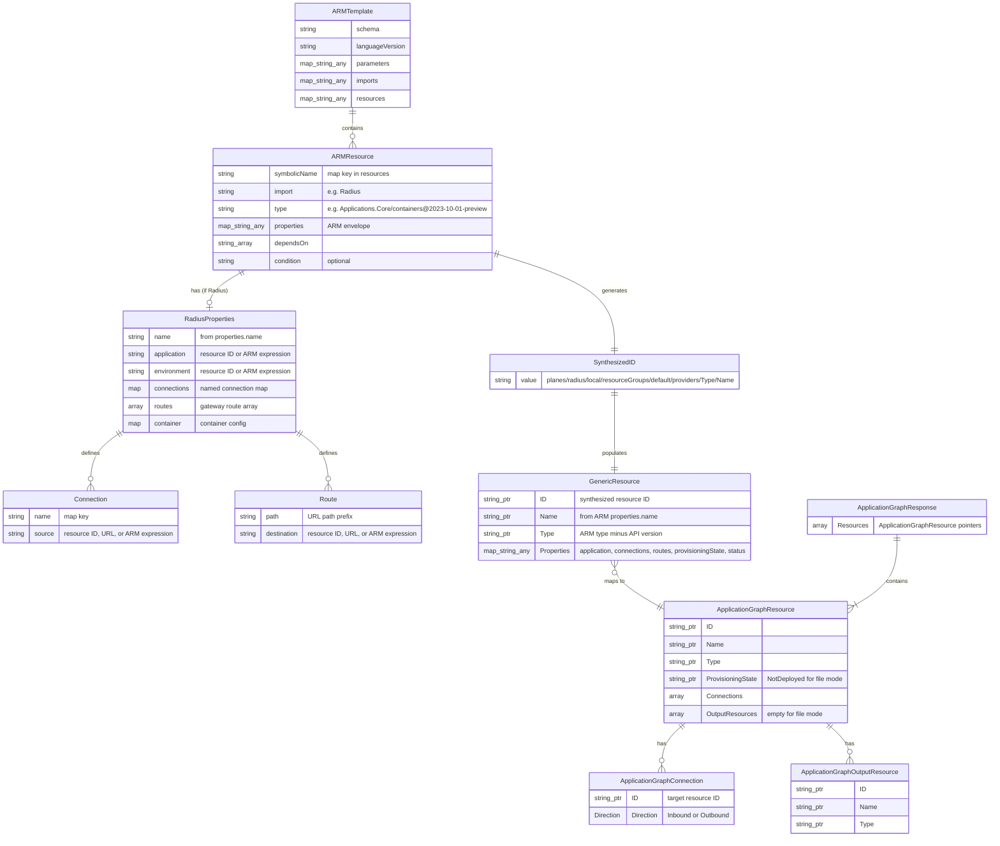
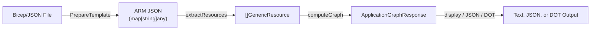
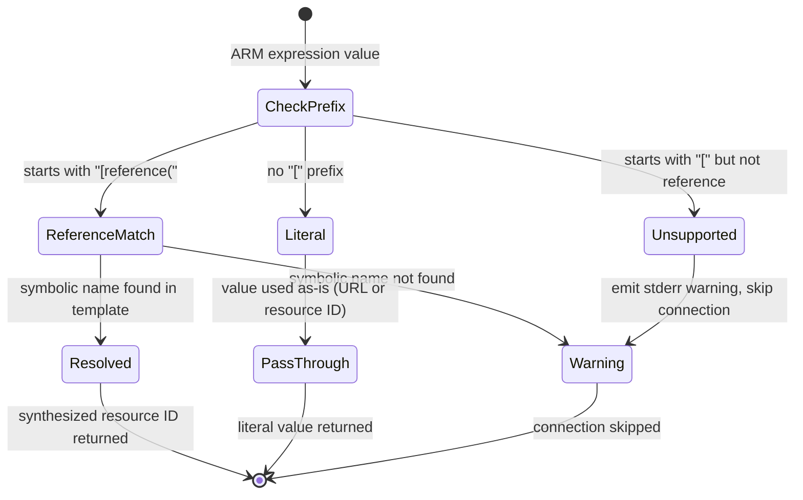
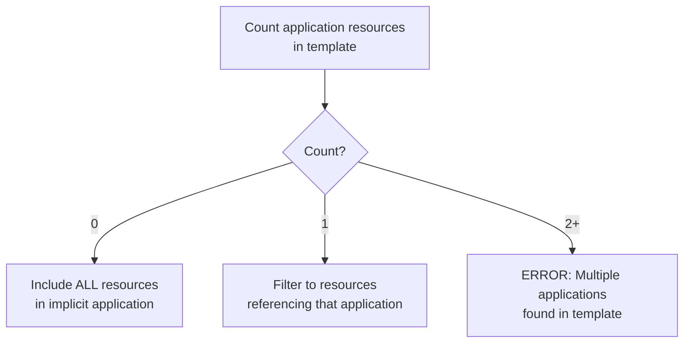

# Data Model: `rad app graph --file` Static Graph from Bicep

**Date**: 2026-03-03
**Feature**: [spec.md](spec.md) | [plan.md](plan.md) | [research.md](research.md)

## Entity Relationship Diagram

## Entities

### 1. ARMTemplate (Input — transient)

The compiled ARM JSON template, produced by `PrepareTemplate()` from a `.bicep` file or parsed directly from a `.json` file.

| Field | Type | Source | Notes |
|-------|------|--------|-------|
| `$schema` | `string` | ARM JSON root | Ignored |
| `languageVersion` | `string` | ARM JSON root | Expected: `"2.1-experimental"` |
| `parameters` | `map[string]any` | ARM JSON root | Not evaluated; parameterized values produce warnings |
| `imports` | `map[string]any` | ARM JSON root | Used to detect Radius resources (`"Radius"` import) |
| `resources` | `map[string]any` | ARM JSON root | Keyed by symbolic name; primary data source |

**Validation rules**:
- `resources` MUST be present and non-nil
- If `resources` is empty, produce "no resources found" message

### 2. ARMResource (Input — transient)

A single resource entry in the `resources` map, keyed by its Bicep symbolic name.

| Field | Type | Source | Notes |
|-------|------|--------|-------|
| `symbolicName` | `string` | Map key | Used for `[reference('X').id]` resolution |
| `import` | `string` | `resources[sym].import` | `"Radius"` indicates a Radius resource |
| `type` | `string` | `resources[sym].type` | Includes API version suffix (e.g., `@2023-10-01-preview`) |
| `properties` | `map[string]any` | `resources[sym].properties` | ARM envelope; contains `name` and nested `properties` |
| `dependsOn` | `[]string` | `resources[sym].dependsOn` | Symbolic name references; informational only |
| `condition` | `string` | `resources[sym].condition` | Optional; triggers warning if present |

**Validation rules**:
- `type` MUST be present and non-empty
- `properties.name` MUST be present for Radius resources (used as resource name)
- If `properties.name` is missing, fall back to symbolic name

### 3. SynthesizedID (Derived — transient)

A generated Radius resource ID used as the unique node key in the graph.

| Field | Type | Derivation |
|-------|------|------------|
| `value` | `string` | `/planes/radius/local/resourceGroups/default/providers/{TypeWithoutAPIVersion}/{Name}` |

**Construction rules**:
- Strip API version suffix from type: `Applications.Core/containers@2023-10-01-preview` → `Applications.Core/containers`
- Name comes from `properties.name` in the ARM envelope
- Must be parseable by `resources.ParseResource()` for compatibility with `computeGraph()`

### 4. GenericResource (Intermediate — transient)

The wire-format resource representation consumed by `computeGraph()`. Reuses the existing `generated.GenericResource` type unchanged.

| Field | Go Type | Value in File Mode |
|-------|---------|-------------------|
| `ID` | `*string` | Synthesized ID |
| `Name` | `*string` | Resource name from ARM properties |
| `Type` | `*string` | Resource type without API version |
| `Properties` | `map[string]any` | See properties map below |
| `Location` | `*string` | Not set (nil) |
| `Tags` | `map[string]*string` | Not set (nil) |

**Properties map structure** (for Radius resources):

| Key | Type | Value |
|-----|------|-------|
| `"application"` | `string` | Resolved application resource ID (from expression resolution) |
| `"environment"` | `string` | Resolved environment resource ID (if present) |
| `"connections"` | `map[string]any` | Connection map with resolved sources |
| `"routes"` | `[]any` | Route array with resolved destinations |
| `"provisioningState"` | `string` | `"NotDeployed"` (hard-coded) |
| `"status"` | `map[string]any` | `{"outputResources": []}` (hard-coded empty) |

**Properties map structure** (for non-Radius resources):

| Key | Type | Value |
|-----|------|-------|
| `"provisioningState"` | `string` | `"NotDeployed"` |
| `"status"` | `map[string]any` | `{"outputResources": []}` |

### 5. ApplicationGraphResponse (Output)

The final graph structure returned by `computeGraph()`. Reuses the existing type from `pkg/corerp/api/v20231001preview/` unchanged.

| Field | Go Type | Notes |
|-------|---------|-------|
| `Resources` | `[]*ApplicationGraphResource` | Sorted deterministically by type, name, ID |

### 6. ApplicationGraphResource (Output)

A node in the application graph. Reuses the existing type unchanged.

| Field | Go Type | Notes |
|-------|---------|-------|
| `ID` | `*string` | Synthesized resource ID |
| `Name` | `*string` | Resource display name |
| `Type` | `*string` | Resource type (no API version) |
| `ProvisioningState` | `*string` | Always `"NotDeployed"` in file mode |
| `Connections` | `[]*ApplicationGraphConnection` | Inbound + outbound, sorted by ID |
| `OutputResources` | `[]*ApplicationGraphOutputResource` | Always empty in file mode |

### 7. ApplicationGraphConnection (Output)

An edge in the application graph. Reuses the existing type unchanged.

| Field | Go Type | Notes |
|-------|---------|-------|
| `ID` | `*string` | Resource ID of the connected resource |
| `Direction` | `*Direction` | `DirectionInbound` or `DirectionOutbound` |

## State Transitions

This feature is stateless — there are no persistent state transitions. The data flows through a pipeline:

### Pipeline Stages

| Stage | Input | Output | Error Handling |
|-------|-------|--------|----------------|
| **Compile** | `.bicep` file path | `map[string]any` (ARM JSON) | Bicep compiler errors → user-facing error |
| **Parse** | `.json` file path | `map[string]any` (ARM JSON) | JSON parse errors → user-facing error |
| **Extract** | ARM JSON `resources` map | `[]GenericResource` | Warnings for unresolvable expressions, conditionals, modules |
| **Graph** | `[]GenericResource` | `*ApplicationGraphResponse` | Partial results on invalid data (existing behavior) |
| **Render** | `*ApplicationGraphResponse` | `string` (text), JSON, or DOT | N/A |

## Expression Resolution State Machine

## Application Scoping Decision Tree

