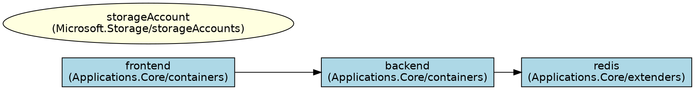

# Research: `rad app graph --file` Static Graph from Bicep

**Date**: 2026-03-03
**Feature**: [spec.md](spec.md) | [plan.md](plan.md)

## 1. ARM JSON Template Structure

### Decision: Use symbolic-name keyed `resources` map

**Rationale**: The compiled ARM JSON uses `languageVersion: 2.1-experimental` format where `resources` is a `map[string]any` (not an array), keyed by Bicep symbolic names. This is the format produced by the current `rad-bicep` compiler and consumed by `PrepareTemplate()`.

**Alternatives considered**:
- Array-based `resources` (older ARM format) — not used by current Bicep compiler; no need to support.

### Structure confirmed

```json
{
  "$schema": "...",
  "languageVersion": "2.1-experimental",
  "parameters": { ... },
  "imports": { "Radius": { "provider": "Radius", "version": "latest" } },
  "resources": {
    "<symbolicName>": {
      "import": "Radius",
      "type": "<Namespace>/<Type>@<apiVersion>",
      "properties": {
        "name": "<resourceName>",
        "properties": {
          "application": "[reference('app').id]",
          "connections": { ... },
          "container": { ... }
        }
      },
      "dependsOn": ["<otherSymbolicName>"]
    }
  }
}
```

Key observations:
- Double-nesting: outer `properties` = ARM envelope (has `name`), inner `properties.properties` = Radius resource properties (has `connections`, `routes`, `application`)
- Resource types include API version suffix: `Applications.Core/containers@2023-10-01-preview`
- Namespace migration underway: `Applications.*` → `Radius.*` (both must be recognized)

## 2. ARM Expression Resolution

### Decision: Regex-based resolution of `[reference('X').id]` pattern only

**Rationale**: The `[reference('symbolicName').id]` pattern is the only ARM expression generated by Bicep for resource ID references. A simple regex `\[reference\('(\w+)'\)\.id\]` covers all observed cases. Full ARM expression evaluation is out of scope and unnecessary.

**Alternatives considered**:
- Full ARM template expression evaluator — too complex, YAGNI
- String prefix matching — fragile, misses edge cases

### Expression patterns found in codebase

| Pattern | Example | Handling |
|---------|---------|----------|
| `[reference('X').id]` | `[reference('app').id]` | Resolve via symbolic name lookup → synthesized resource ID |
| Literal URLs | `http://backend:3000` | Pass through to `findSourceResource()` for hostname matching |
| `[parameters('X')]` | `[parameters('location')]` | Skip with warning (parameter values unavailable) |
| `[format(...)]` | `[format('{0}-env', parameters('name'))]` | Skip with warning (complex expression) |
| `[int(...)]` | `[int(parameters('replicas'))]` | Skip with warning (complex expression) |

### Resolution algorithm

1. If value matches `\[reference\('(\w+)'\)\.id\]` → extract symbolic name → look up in template resources → synthesize resource ID
2. If value is a plain string (no `[` prefix) → treat as literal (URL or resource ID) → pass to `findSourceResource()`
3. If value starts with `[` but doesn't match the reference pattern → skip with warning

## 3. Synthetic Resource ID Generation

### Decision: Use `/planes/radius/local/resourceGroups/default/providers/{Type}/{Name}`

**Rationale**: The existing `computeGraph()` and `findSourceResource()` functions use resource IDs as node keys. Synthesized IDs need to be valid Radius resource ID format. The `default` resource group is a safe placeholder since IDs are only used as internal graph keys.

**Alternatives considered**:
- Using symbolic names as keys directly — would require modifying `computeGraph()`, violating reuse principle
- Using actual resource group from workspace config — would require workspace connection, violating offline requirement

### Type stripping

ARM JSON type `Applications.Core/containers@2023-10-01-preview` → strip `@...` suffix → `Applications.Core/containers`

## 4. GenericResource Construction

### Decision: Build `[]generated.GenericResource` from ARM JSON template

**Rationale**: `computeGraph()` accepts `[]generated.GenericResource`. Each resource needs `ID`, `Name`, `Type`, and `Properties` (map with `application`, `connections`, `routes`, `provisioningState`, `status`).

### Mapping

| GenericResource field | Source in ARM JSON |
|----------------------|-------------------|
| `ID` | Synthesized: `/planes/radius/local/resourceGroups/default/providers/{Type}/{Name}` |
| `Name` | `resources[sym].properties.name` |
| `Type` | `resources[sym].type` with `@apiVersion` stripped |
| `Properties["application"]` | `resources[sym].properties.properties.application` (after expression resolution) |
| `Properties["connections"]` | `resources[sym].properties.properties.connections` (after expression resolution of each source) |
| `Properties["routes"]` | `resources[sym].properties.properties.routes` (after expression resolution of destinations) |
| `Properties["provisioningState"]` | Hard-coded: `"NotDeployed"` |
| `Properties["status"]["outputResources"]` | Hard-coded: `[]` |

## 5. Non-Radius Resource Detection

### Decision: Include non-Radius resources as graph nodes; detect via `import` field or namespace prefix

**Rationale**: Radius resources in ARM JSON have `"import": "Radius"` and types prefixed with `Applications.*` or `Radius.*`. Non-Radius resources (e.g., `Microsoft.Resources/deployments`, `Microsoft.Storage/storageAccounts`) lack the Radius import and have different namespace prefixes.

### Detection logic

1. Check `import` field: if `"Radius"` (case-insensitive) → Radius resource
2. Fallback: check type prefix against known Radius namespaces (`Applications.`, `Radius.`)
3. Non-Radius resources → include as graph nodes with type and name, no Radius-specific properties

## 6. Module References

### Decision: Detect and warn; do not traverse

**Rationale**: Bicep modules compile to `Microsoft.Resources/deployments` resources with nested templates. Traversing nested templates would require recursive processing and cross-scope expression resolution, which is out of scope.

### Detection

Resources with type `Microsoft.Resources/deployments` are module references. Emit a warning listing them.

## 7. Conditional Resources

### Decision: Include with warning

**Rationale**: Conditional Bicep resources would have a `"condition"` field in the ARM JSON. No examples were found in the current Radius test fixtures, but the pattern is supported by ARM. Including them with a warning is consistent with the graceful degradation principle.

## 8. Application Scoping

### Decision: Count application resources, branch on 0/1/many

**Rationale**: Per clarified spec:
- 0 apps → all resources in one implicit application
- 1 app → scope to resources referencing that app
- 2+ apps → error with message

### Application detection

A resource is an application resource if its type (after stripping API version) ends with `/applications` and starts with a known Radius namespace prefix (`Applications.Core/` or `Radius.Core/`).

## 9. Existing Code Reuse Assessment

| Component | Reuse Strategy |
|-----------|---------------|
| `PrepareTemplate()` | Direct call — handles both `.bicep` and `.json`. Progress output (`"Building ..."`) routed to stderr via Bicep `OutputWriter` backed by `RootCmd.ErrOrStderr()` |
| `computeGraph()` | Direct call — accepts `[]GenericResource`, returns `*ApplicationGraphResponse` |
| `findSourceResource()` | Indirect — used internally by `computeGraph()`, no changes needed |
| `display()` | Direct call — renders graph to text |
| `--output` flag | Reuse existing `AddOutputFlag()` + `RequireOutput()` pattern; extend validation to accept `"dot"` |
| `Runner` struct | Extend with `FilePath` field and branching logic in `Validate()`/`Run()` |

## 10. Graphviz DOT Output Format

### Decision: New `displayDot()` function producing DOT language output

**Rationale**: Graphviz DOT is the de facto standard for text-based graph description. It is consumed by the `dot` CLI tool (part of Graphviz), VS Code extensions (Graphviz Preview, Graphviz Interactive Preview), online renderers (edotor.net, dreampuf.github.io/GraphvizOnline), and many documentation tools. Producing DOT output provides a path to visual diagrams without adding a rendering dependency to the CLI binary.

**Alternatives considered**:
- Mermaid — popular in GitHub Markdown but requires a JavaScript runtime for rendering; less tooling for CLI-based workflows
- SVG/PNG direct rendering — would require bundling a rendering engine (cairo, etc.) into the CLI binary; violates simplicity principle
- PlantUML — requires Java runtime; less universal than DOT

### DOT format structure



### Design decisions for DOT output

| Decision | Choice | Rationale |
|----------|--------|-----------|
| Graph direction | `rankdir=LR` (left-to-right) | Natural reading order for data flow; more readable than top-to-bottom for typical app graphs |
| Node IDs | Resource name | Unique within a graph; readable in the DOT source |
| Node labels | `name\n(type)` | Shows both name and type at a glance |
| Radius node shape | `box` | Default Graphviz shape; clean rectangular look |
| Non-Radius node shape | `ellipse` | Visual distinction from Radius resources |
| Radius node color | `lightblue` | Neutral, readable, prints well in grayscale |
| Non-Radius node color | `lightyellow` | Distinct from Radius, still readable |
| Edge direction | Source → target (outbound connections) | Matches the connection direction semantics |
| Duplicate edges | Deduplicated | A→B appears once even if multiple named connections exist |
| Availability | Both `--file` and live modes | Consistent experience regardless of mode |

### Node ID uniqueness

Resource names may not be unique across types (e.g., a container named `redis` and an extender named `redis`). Node IDs in DOT are generated from the synthesized resource ID (or live resource ID) to guarantee uniqueness, while the label shows the human-readable name and type.

## 11. Testing Strategy

### Unit tests (template.go)

- Parse ARM JSON with various resource types → verify correct `GenericResource` construction
- ARM expression resolution → verify `[reference('X').id]` resolves correctly
- Unresolvable expressions → verify warnings emitted, connection skipped
- Non-Radius resources → verify included as untyped nodes
- Application scoping → verify 0/1/many app handling
- Duplicate resource names → verify warning

### Integration tests (graph_test.go)

- End-to-end: `.bicep` file → compile → extract → graph → text output
- End-to-end: `.json` file → extract → graph → text output
- Mutual exclusivity: `--file` + app name → error
- `--output json` with `--file` → JSON output
- `--output dot` with `--file` → valid DOT output with digraph wrapper, nodes, edges
- File not found → error
- Empty template → empty graph message

### Test fixtures

Use existing ARM JSON test fixtures in `pkg/cli/bicep/testdata/` and `test/functional-portable/` as reference. Create new minimal fixtures in `pkg/cli/cmd/app/graph/testdata/` for unit tests.
