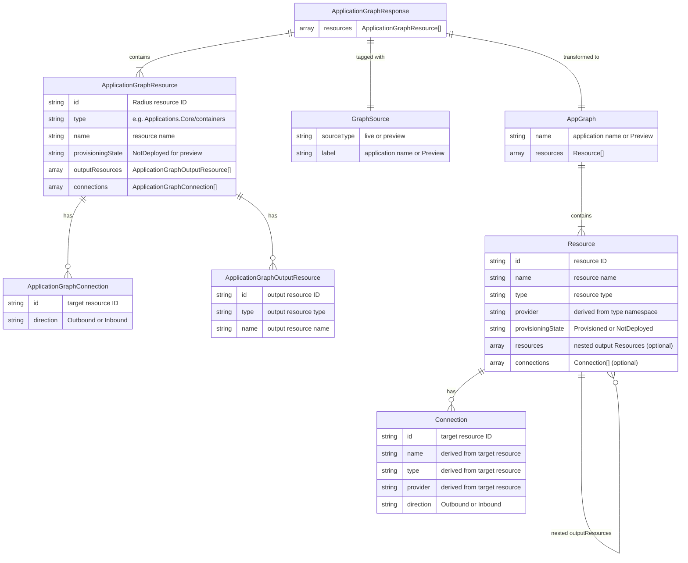

# Data Model: View Static Bicep Application Graphs in the Radius Dashboard

**Date**: 2026-03-05
**Feature**: [spec.md](spec.md) | [plan.md](plan.md) | [research.md](research.md)

## Entity Relationship Diagram



## Entities

### 1. ApplicationGraphResponse (Input — API/CLI format)

The JSON data format produced by `rad app graph --file --output json`. This is the **input** format that users paste or upload into the dashboard.

| Field | Type | Description | Preview Value |
|-------|------|-------------|---------------|
| `resources` | `ApplicationGraphResource[]` | Array of resources in the graph | All resources from the Bicep file |

### 2. ApplicationGraphResource (Input — nested)

A resource in the API response format.

| Field | Type | Description | Preview Value |
|-------|------|-------------|---------------|
| `id` | `string` | Synthesized Radius resource ID | `planes/radius/local/resourceGroups/default/providers/Type/Name` |
| `type` | `string` | Radius resource type | e.g., `Applications.Core/containers` |
| `name` | `string` | Resource name from Bicep | e.g., `webapp` |
| `provisioningState` | `string` | Deployment status | Always `"NotDeployed"` for preview |
| `outputResources` | `ApplicationGraphOutputResource[]` | Cloud resources backing this | Always `[]` for preview |
| `connections` | `ApplicationGraphConnection[]` | Connections to other resources | Derived from Bicep `connections` and `routes` |

### 3. ApplicationGraphOutputResource (Input — nested)

A cloud resource backing a Radius resource. Always empty for preview graphs.

| Field | Type | Description |
|-------|------|-------------|
| `id` | `string` | Cloud resource ID |
| `type` | `string` | Cloud resource type |
| `name` | `string` | Cloud resource name |

### 4. ApplicationGraphConnection (Input — nested)

A connection between resources in the API format.

| Field | Type | Description |
|-------|------|-------------|
| `id` | `string` | Target resource ID |
| `direction` | `"Outbound" \| "Inbound"` | Connection direction |

### 5. GraphSource (Internal — metadata)

Metadata indicating how the current graph was loaded. Used to determine visual styling and UI indicators.

| Field | Type | Description |
|-------|------|-------------|
| `sourceType` | `"live" \| "preview"` | Whether graph came from API or import |
| `label` | `string` | Display label (app name for live, "Preview" for imported) |

### 6. AppGraph (Rendering — dashboard internal)

The dashboard's internal graph type consumed by the `<AppGraph>` React component. Produced by transforming `ApplicationGraphResponse` input.

| Field | Type | Description |
|-------|------|-------------|
| `name` | `string` | Application name or "Preview" |
| `resources` | `Resource[]` | Array of resources for rendering |

### 7. Resource (Rendering — dashboard internal)

A resource node in the dashboard's graph component.

| Field | Type | Description | Derivation |
|-------|------|-------------|-----------|
| `id` | `string` | Resource ID | Direct from `ApplicationGraphResource.id` |
| `name` | `string` | Resource name | Direct from `ApplicationGraphResource.name` |
| `type` | `string` | Resource type | Direct from `ApplicationGraphResource.type` |
| `provider` | `string` | Provider namespace | Extracted from `type` (e.g., `Applications.Core` from `Applications.Core/containers`) |
| `provisioningState` | `string` | Deployment status | Direct from `ApplicationGraphResource.provisioningState` |
| `resources` | `Resource[]` (optional) | Output resources | Mapped from `ApplicationGraphOutputResource[]` |
| `connections` | `Connection[]` (optional) | Connections | Mapped from `ApplicationGraphConnection[]` with enrichment |

### 8. Connection (Rendering — dashboard internal)

A connection edge in the dashboard's graph component.

| Field | Type | Description | Derivation |
|-------|------|-------------|-----------|
| `id` | `string` | Target resource ID | Direct from `ApplicationGraphConnection.id` |
| `name` | `string` | Target resource name | Looked up from resources by ID |
| `type` | `string` | Target resource type | Looked up from resources by ID |
| `provider` | `string` | Target provider namespace | Extracted from looked-up type |
| `direction` | `"Outbound" \| "Inbound"` | Connection direction | Direct from `ApplicationGraphConnection.direction` |

## Data Transformation

### API → Dashboard Type Mapping

```
ApplicationGraphResponse          →  AppGraph
├── (no name field)               →  name: "Preview"
└── resources[]                   →  resources[]
    ├── id                        →  id
    ├── name                      →  name
    ├── type                      →  type
    ├── (derive provider)         →  provider: type.split('/')[0]
    ├── provisioningState         →  provisioningState
    ├── outputResources[]         →  resources[] (recursive mapping)
    │   ├── id                    →  id
    │   ├── name                  →  name
    │   └── type                  →  type
    └── connections[]             →  connections[] (enriched)
        ├── id                    →  id
        ├── direction             →  direction
        ├── (lookup by id)        →  name
        ├── (lookup by id)        →  type
        └── (derive from type)    →  provider
```

### Validation Rules

The following validations apply when importing `ApplicationGraphResponse` JSON:

| Rule | Field | Validation |
|------|-------|-----------|
| V-001 | root | Must be a valid JSON object |
| V-002 | `resources` | Must be present and an array |
| V-003 | `resources[].id` | Must be a non-empty string |
| V-004 | `resources[].type` | Must be a non-empty string |
| V-005 | `resources[].name` | Must be a non-empty string |
| V-006 | `resources[].provisioningState` | Must be a string (may be empty) |
| V-007 | `resources[].outputResources` | Must be an array (may be empty) |
| V-008 | `resources[].connections` | Must be an array (may be empty) |
| V-009 | `resources[].connections[].id` | Must be a non-empty string |
| V-010 | `resources[].connections[].direction` | Must be `"Outbound"` or `"Inbound"` |

### Empty Graph Handling

When `resources` is an empty array `[]`, the graph is valid but empty. The dashboard should display a message like "No resources found in the imported graph" instead of a blank canvas.
